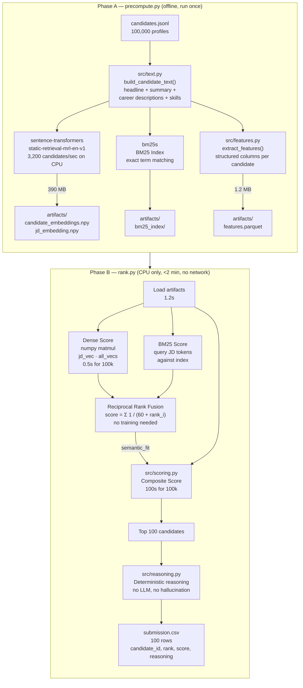
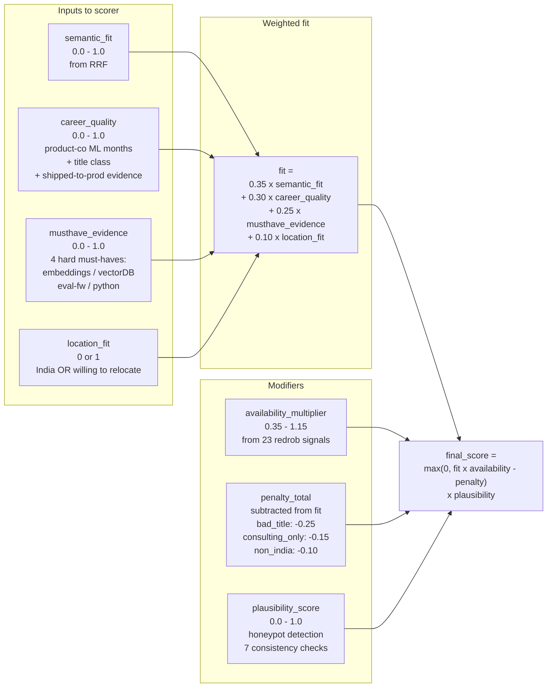
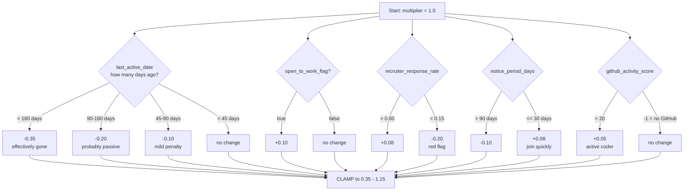
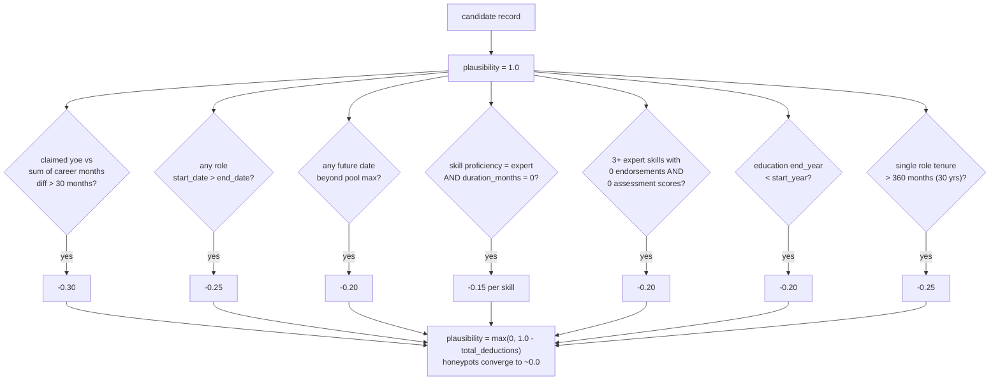

# Redrob Intelligent Candidate Ranking

Hackathon submission for the Redrob "Intelligent Candidate Discovery & Ranking Challenge".  
Ranks 100,000 candidate profiles against a Senior AI Engineer JD.  
Output: top 100 best-fit candidates with factual reasoning, in under 2 minutes on CPU.

---

## Quick Start

```bash
# 1. Create venv and install
py -3 -m venv .venv
.venv\Scripts\activate        # Windows
pip install -r requirements.txt

# 2. Place data files
#    data/sample_candidates.json   (50-candidate sample)
#    data/candidates.jsonl         (full 100k pool)

# 3. Precompute artifacts (run once — ~3.5 min on CPU)
python precompute.py --candidates data/candidates.jsonl

# 4. Rank and produce submission
python rank.py --candidates data/candidates.jsonl --out submission.csv

# Explain a single candidate score
python rank.py --candidates data/candidates.jsonl --explain CAND_0046064

# Validate format
python validate_submission.py submission.csv --candidates data/candidates.jsonl
```

---

## System Architecture

The pipeline has two phases. Phase A runs offline (no time limit, GPU allowed).
Phase B runs at submission time (CPU only, under 5 minutes, no network).



---

## Composite Scoring Formula

This is the heart of the system. Every number comes from `config.py`.



---

## Availability Multiplier

How behavioral signals from the platform modify the score.



---

## Honeypot / Plausibility Detection

How suspicious profiles are caught without a hardcoded ID list.



---

## How Reasoning is Generated (No Hallucination)

```mermaid
flowchart LR
    subgraph SLOTS["Slot-based assembly — only real facts"]
        S1["Slot A\ncurrent_title at current_company\n(product co vs services firm)"]
        S2["Slot B\nbest evidence phrase\nfrom career_history description\n(regex match, real sentence)"]
        S3["Slot C\ntop 2 matched skills\nfrom candidates own skills array\nwith platform assessment score"]
        S4["Slot D\nhonest concern\nnotice period / low response rate\n/ inactive / location mismatch"]
    end

    subgraph TONE["Tone by rank tier"]
        T1["Rank 1-10\nconfident + specific\nall 4 slots"]
        T2["Rank 11-50\nconfident with caveat\nslots A + C + D"]
        T3["Rank 51-100\nexplicitly marginal\nadjacent fit language"]
    end

    subgraph GUARD["Hallucination guard"]
        V["validate_no_hallucination()\nasserts every skill name mentioned\nexists in candidates skills array\nevery employer mentioned\nexists in career_history"]
    end

    SLOTS --> TONE --> GUARD --> OUT["reasoning string\n1-2 sentences\nASCII clean, factual"]
```



---

## File Structure

```
.
├── config.py              # ALL weights, thresholds, regex patterns (single source of truth)
├── precompute.py          # Phase A: embed + BM25 + features -> artifacts/
├── rank.py                # Phase B: load artifacts -> score -> submission.csv
├── validate_submission.py # Format validator (7 checks)
├── src/
│   ├── parsing.py         # JSON array + JSONL streaming loader
│   ├── text.py            # Candidate + JD text builders
│   ├── features.py        # Structured feature extraction (regex, heuristics)
│   ├── retrieval.py       # Dense cosine + BM25 + RRF + optional cross-encoder
│   ├── signals.py         # Availability multiplier from 23 redrob signals
│   ├── scoring.py         # Composite score + --explain mode
│   ├── consistency.py     # Honeypot detection (7 plausibility checks)
│   └── reasoning.py       # Deterministic slot-based reasoning generator
├── data/                  # candidates.jsonl, sample_candidates.json, schema
├── artifacts/             # candidate_embeddings.npy, bm25_index/, features.parquet
└── .venv/                 # project-local virtualenv
```

---

## Performance

| Step | Time |
|------|------|
| Precompute 100k (Phase A) | ~3.5 min |
| Load artifacts | 1.2s |
| Dense + BM25 + RRF scoring | 1.7s |
| Composite scoring 100k | ~101s |
| Reasoning + CSV write | ~1s |
| **Total rank.py** | **~1 min 53 sec** |

Budget constraint: 5 min wall-clock. Actual: under 2 min.
